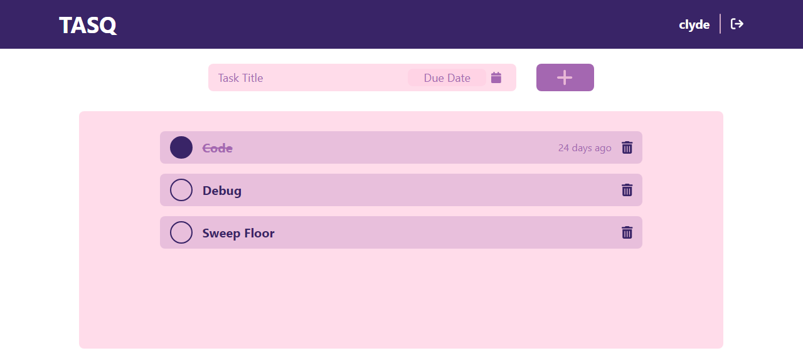

 

  

  <h3 align="center">TASQ - Task Management</h3>

  

    A Simple yet Effective Task Management App
     
     
    <a href="https://tasq-app.onrender.com">View Web App</a>
  

## Table Of Contents

* [About the Project](#about-the-project)
* [Built With](#built-with)
* [Getting Started](#getting-started)
* [Usage](#usage)

## About The Project

I wanted to learn how full stack application work and I also want to track the things that I have to do so I made an app that will hone my full stack development skills.

## Built With

This app is build with the MERN Stack. ReactJs and TailwindCss for the Frontend. NodeJs, ExpressJs, and MongoDB for the Backend.

## Getting Started
- Login your account if you already have one if not you can sign up first.

## Usage
- Create a task with/without a due date 
- Mark a tasks as completed 
- Delete a task

## Roadmap
- Responsive layout for mobile devices
